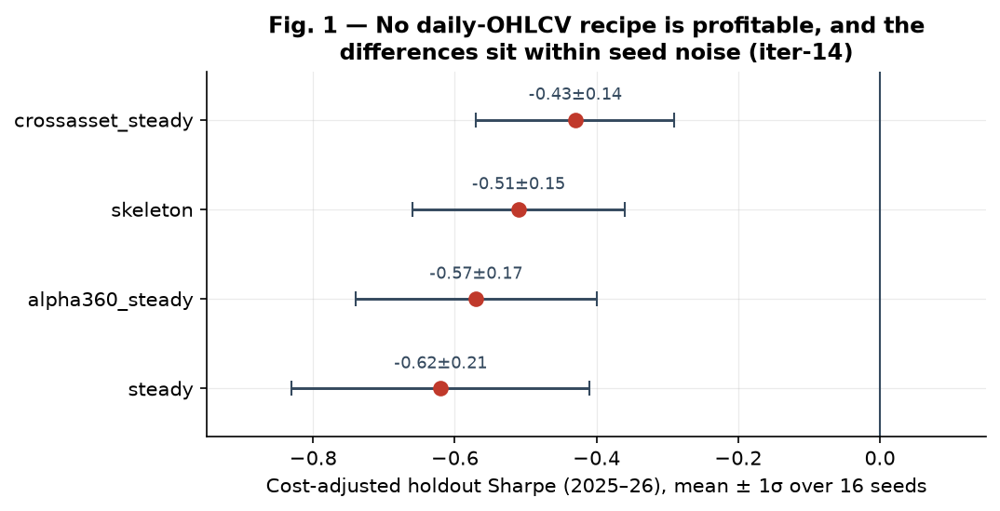
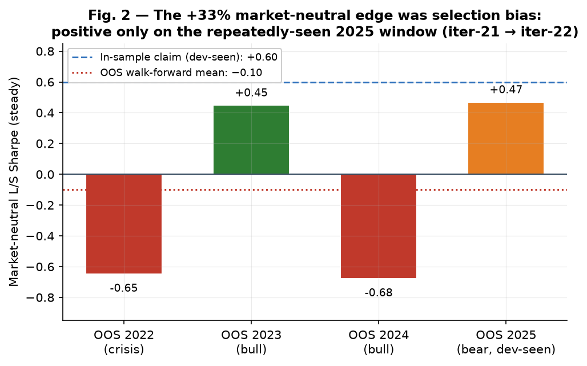
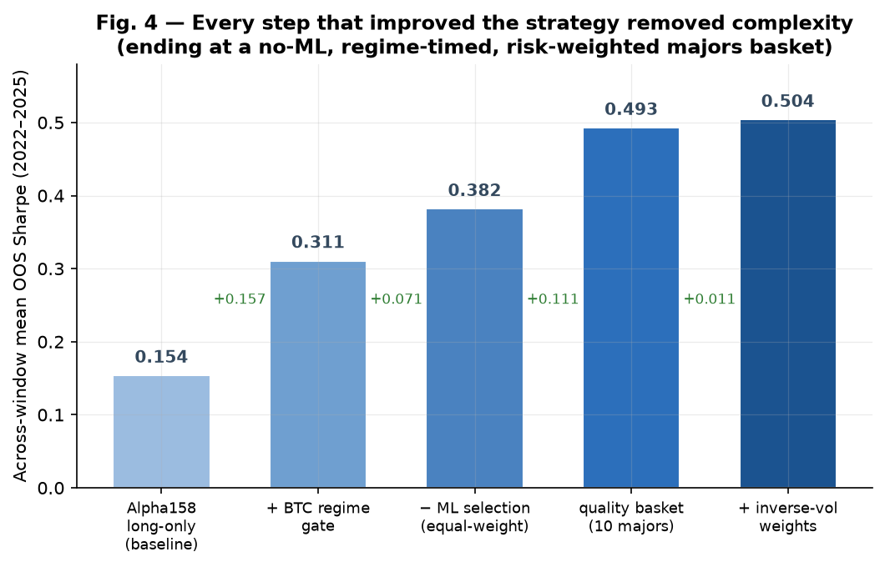
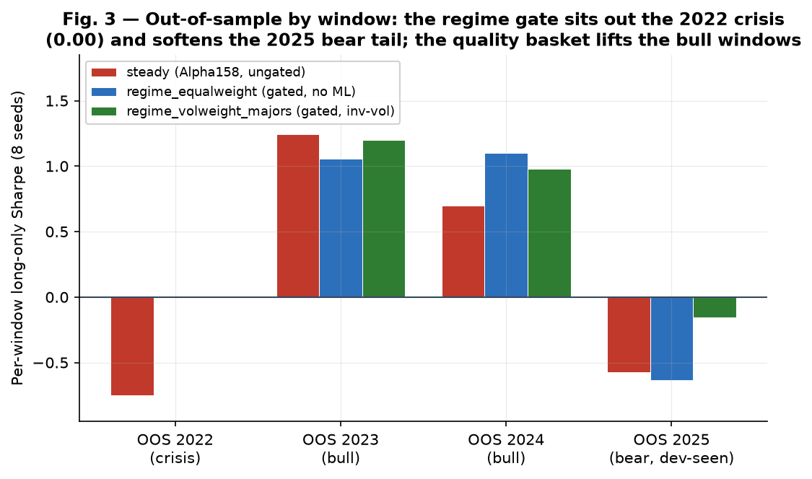
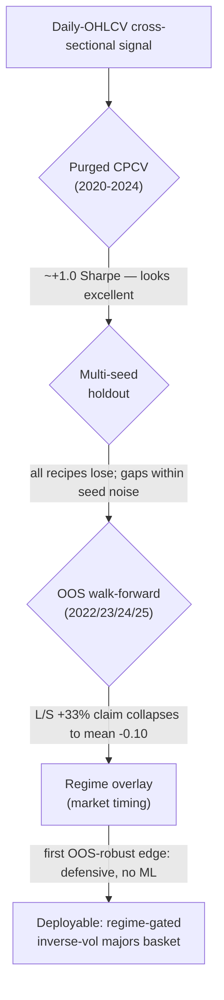
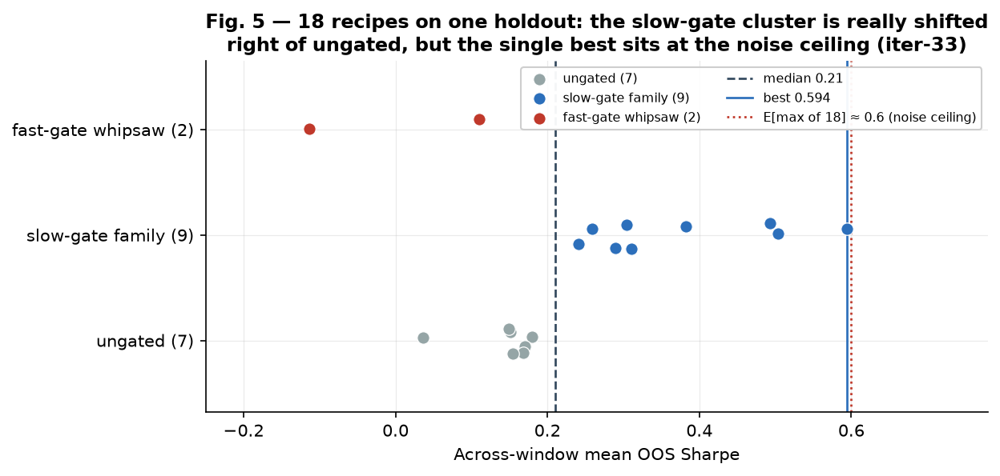
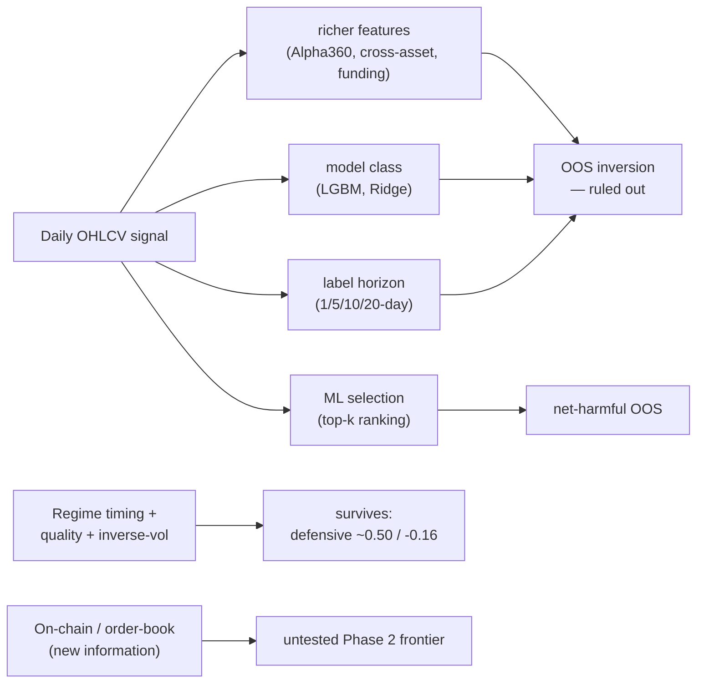

# Phase 1 Research Summary — Daily Cross-Sectional Crypto Quant

*A self-contained research narrative of the project's first phase (iterations 1–33): why each
question was asked, what data made it answerable, the hypothesis, how it was validated, and the
verdict — from a quant researcher's perspective. Engineering and implementation are deliberately
omitted. Every quantitative claim is backed by a table here and consolidated in the
[Data Appendix](#data-appendix); figures are reproducible from those tables via
[`02.phase1-figures/make_figures.py`](02.phase1-figures/make_figures.py). Companion documents: the originating roadmap
[`01.binance-eea-spot-quant.md`](01.binance-eea-spot-quant.md) and the authoritative per-iteration
log [`../iterations-history.md`](../iterations-history.md).*

<!-- mdformat-toc start --slug=github --maxlevel=3 --minlevel=2 -->

- [Abstract](#abstract)
- [Key facts at a glance](#key-facts-at-a-glance)
- [Reading this report — measurement lenses](#reading-this-report-%E2%80%94-measurement-lenses)
- [1. The mandate](#1-the-mandate)
- [2. The research apparatus](#2-the-research-apparatus)
  - [2.1 Data acquired](#21-data-acquired)
  - [2.2 Validation methodology](#22-validation-methodology)
  - [2.3 The evaluation window](#23-the-evaluation-window)
- [3. The central anomaly](#3-the-central-anomaly)
- [4. The search for a generalizing edge](#4-the-search-for-a-generalizing-edge)
- [5. Monetization and the OOS reckoning](#5-monetization-and-the-oos-reckoning)
- [6. The one thing that worked](#6-the-one-thing-that-worked)
- [7. The honesty capstone](#7-the-honesty-capstone)
- [8. Where Phase 1 ended](#8-where-phase-1-ended)
- [9. Lessons learned](#9-lessons-learned)
- [Data appendix](#data-appendix)
  - [A.1 — Multi-seed holdout, 4 recipes (iter-14, 16 seeds, 2025–26 holdout lens)](#a1-%E2%80%94-multi-seed-holdout-4-recipes-iter-14-16-seeds-2025%E2%80%9326-holdout-lens)
  - [A.2 — Funding feature A/B (iter-20, 16 seeds, paired, holdout lens)](#a2-%E2%80%94-funding-feature-ab-iter-20-16-seeds-paired-holdout-lens)
  - [A.3 — Market-neutral L/S, dev-seen holdout (iter-21, 16 seeds)](#a3-%E2%80%94-market-neutral-ls-dev-seen-holdout-iter-21-16-seeds)
  - [A.4 — Market-neutral L/S, OOS walk-forward (iter-22, 8 seeds, per-window Sharpe)](#a4-%E2%80%94-market-neutral-ls-oos-walk-forward-iter-22-8-seeds-per-window-sharpe)
  - [A.5 — Regime / basket / weighting, OOS stress (iters 29–32, 8 seeds, per-window long-only Sharpe)](#a5-%E2%80%94-regime--basket--weighting-oos-stress-iters-29%E2%80%9332-8-seeds-per-window-long-only-sharpe)
  - [A.6 — The 18-recipe sweep on one holdout (iter-33, across-window mean OOS Sharpe)](#a6-%E2%80%94-the-18-recipe-sweep-on-one-holdout-iter-33-across-window-mean-oos-sharpe)
- [The directed search — decision log (iters 12–33)](#the-directed-search-%E2%80%94-decision-log-iters-12%E2%80%9333)
- [Provenance & reproducibility](#provenance--reproducibility)

<!-- mdformat-toc end -->

______________________________________________________________________

## Abstract

The project tested whether a **cross-sectional machine-learning ranker on daily OHLCV** produces a
tradeable, out-of-sample edge across a ~20-coin crypto universe (spot-only, Binance-EEA, ~$10,000,
long/cash). Across 33 iterations under purged combinatorial cross-validation, multi-seed holdout
distributions, and an out-of-sample walk-forward, the answer is **no**: the signal is strongly
positive in-sample (~+1.0 Sharpe) but **inverts out-of-sample** on the 2025–2026 holdout, and this
failure is **invariant to features, model class, and prediction horizon**. The ML cross-sectional
selection is, in fact, **net-harmful** out-of-sample versus simply holding the basket. The *only*
edge that survives honest validation is **risk management, not prediction**: a slow BTC-trend regime
overlay on a quality, inverse-volatility-weighted passive basket (no ML), with an across-window mean
Sharpe of ~0.50 and a worst-window of −0.16 — and even that headline is **optimistically biased**
(18 recipes were tested on one holdout). Phase 1's deliverable is a rigorously-mapped set of dead
ends, one defensive baseline, and a single identified frontier: **new information (on-chain /
order-book data)**.

## Key facts at a glance

| Item                   | Value                                                                                                                        |
| ---------------------- | ---------------------------------------------------------------------------------------------------------------------------- |
| **Operating scope**    | Daily bars, spot-only, Binance-EEA (MiCA → USDC venue), ~$10,000, long/cash (no shorting on spot)                            |
| **Universe**           | 19 USDT-quoted majors/mid-caps (+ survivorship-free extensions); modeled on USDT history, executed on USDC                   |
| **Data acquired**      | OHLCV 2020-01→2026-06 (~31 instruments); perpetual funding-rate carry; a tick-level aggTrades cost sample                    |
| **Validation**         | Purged+embargoed combinatorial CV (CPCV) + deflated Sharpe / PBO; multi-seed holdout distributions; OOS annual walk-forward  |
| **Evaluation window**  | dev/CV 2020–2024; **OOS holdout 2025-01-01 → 2026-06-15 — a deep bear** (BTC −32%, ETH −50%, SOL −65%)                       |
| **Central result**     | No tradeable cross-sectional OHLCV alpha OOS; the signal inverts; ML selection is net-harmful                                |
| **Best deployable**    | Regime-gated, inverse-vol-weighted basket of the 10 large-cap majors — **no ML**; mean OOS Sharpe ≈ 0.50, worst window −0.16 |
| **Honest expectation** | True OOS Sharpe **< 0.50** (18-recipe selection inflation ≈ +0.38); needs fresh-data / forward validation                    |
| **Phase 2 frontier**   | New information — on-chain / order-book data                                                                                 |

## Reading this report — measurement lenses

Two different Sharpe lenses appear below and **must not be conflated**:

- **2025-only holdout Sharpe** — the single 2025-01→2026-06 *bear* window, used as the dev
  test-segment since iter-9. It is **negative for every long-only book** (e.g. `steady` −0.585);
  this is the "the strategy loses in the bear" lens. Multi-seed numbers in §3–§5 use it.
- **Across-window mean OOS Sharpe** — the average of four annual walk-forward windows
  (2022/2023/2024/2025), each trained only on prior data. It is **positive** because it includes the
  2023/2024 bull windows. The regime/basket progression in §6 (0.15 → 0.50) lives on this lens.

The same strategy can read −0.58 on the first lens and +0.15 on the second; that is not a
contradiction, it is two different questions ("how did it do in *the* bear?" vs "how does it do
*across regimes*?").

Other conventions: **cost-adjusted Sharpe** (net of realistic fees + slippage) is read throughout,
never gross ending value; **z (separation)** = mean-gap / pooled-σ across seeds, with |z| ≳ 2 taken
as "beyond seed noise"; **DSR / PBO** = deflated Sharpe (corrected for number of trials) /
probability of backtest overfitting.

______________________________________________________________________

## 1. The mandate

**The triggering frame.** The project began from a concrete operating brief (roadmap §0): an
~$10,000, spot-only, Binance-EEA account; an hours-to-days horizon; **daily bars** as the starting
frequency; USDC as the regulated execution venue (MiCA having removed USDT spot from EEA accounts);
and a single chosen strategy family — a **cross-sectional ML ranker** over ~20 liquid majors/mid-caps,
predicting 1–3-day forward returns, rebalanced daily, **long/cash** (shorting unavailable on spot),
with a **BTC-trend regime overlay** to scale exposure down in bear/chop regimes.

**The prior, stated up front.** The roadmap was explicit that this is a hard problem: most retail
algo strategies lose money or fail to beat buy-and-hold; a realistic plan is 0.5–1.2 *net* Sharpe
(not the 1.0–2.0 gross seen in the literature), with 15–30% drawdowns; backtest overfitting and
regime change are the primary killers; and the first year is best treated as an education expense.

**The central research question.** *Does a cross-sectional ML ranker on daily OHLCV produce a
tradeable, out-of-sample edge across this crypto universe — and if not, what (if anything) does?*

## 2. The research apparatus

The verdicts below are only as trustworthy as the data and the validation behind them, so both are
summarized first.

### 2.1 Data acquired

| Stream                           | What                                                                                                                                                    | Why it was acquired                                                                                    |
| -------------------------------- | ------------------------------------------------------------------------------------------------------------------------------------------------------- | ------------------------------------------------------------------------------------------------------ |
| **Daily OHLCV**                  | ~31 instruments, 2020-01 onward (no pre-2020 history exists for this universe)                                                                          | The base panel for all cross-sectional signals                                                         |
| **Survivorship-free history**    | 10 ever-top-25 majors that blew up / faded (FTT through the FTX suspension, WAVES/OMG/XEM/BTG/NANO …) + Terra (old LUNA capped at its 2022-05-13 crash) | Remove "today's survivors only" bias from the panel                                                    |
| **Perpetual funding-rate carry** | Daily funding per instrument                                                                                                                            | The one genuinely *new* information stream (cost-of-leverage / crowding) that OHLCV structurally lacks |
| **aggTrades cost sample**        | A liquidity-spanning slice of tick data                                                                                                                 | Replace *assumed* execution costs with *measured* slippage + maker-fill                                |

The traded universe is 19 USDT-quoted majors/mid-caps; the USDT history is modeled as an
economically identical proxy for the USDC execution leg. The **no-pre-2020 / single-bear-holdout**
limitation recurs as a binding constraint on what can be concluded (see §9, lesson 8).

### 2.2 Validation methodology

- **Purged, embargoed combinatorial cross-validation (CPCV)** with a deflated Sharpe ratio and a
  probability-of-backtest-overfitting (PBO) statistic — the in-sample rigor.
- **Multi-seed holdout distributions** — every verdict read as a distribution over training seeds,
  not a single run (this proved essential; see §3).
- **An out-of-sample walk-forward "stress" harness** — rolling annual test windows
  (2022/2023/2024/2025), each trained only on prior data, so a claimed edge is measured on periods
  never tuned against.

### 2.3 The evaluation window

The dev/CV period is 2020–2024; the holdout is **2025-01-01 to 2026-06-15 — a deep bear market**
(BTC −32%, ETH −50%, SOL −65%). This single fact shapes nearly every verdict that follows.

______________________________________________________________________

## 3. The central anomaly

The baseline cross-sectional Alpha158 / gradient-boosted ranker produced the defining pattern of the
whole project: a **strongly positive cross-validated Sharpe (~+1.0) on 2020–2024 that inverted to
negative on the 2025–2026 holdout** (PBO ≈ 0.9–0.99). The model that looked excellent in-sample lost
money, specifically, in the out-of-sample bear.

Two early findings reframed how every subsequent result had to be read:

- **In-sample success is not out-of-sample edge.** A high CV Sharpe with a near-1.0 PBO is the
  signature of a regime-fit model, not a robust one.
- **Seed noise dwarfs the differences being chased.** The same recipe, retrained on a different
  stochastic seed, swung from one apparent ranking to another. The first variance-aware comparison
  (iter-14, 16 seeds) showed that the four candidate recipes were all losers *and* statistically
  indistinguishable — the single-run rankings that preceded it had been luck.

**Table 3.1 — 16-seed holdout (2025–26), cost-adjusted Sharpe (iter-14, [PR #46](https://github.com/zhaow-de/zcrypto/pull/46)).**

| recipe            | Sharpe (mean ± σ) | ending (USDT) | PSR   |
| ----------------- | ----------------- | ------------- | ----- |
| crossasset_steady | −0.43 ± 0.14      | ~4,507        | 0.266 |
| skeleton          | −0.51 ± 0.15      | ~4,329        | 0.228 |
| alpha360_steady   | −0.57 ± 0.17      | ~3,827        | 0.203 |
| steady            | −0.62 ± 0.21      | ~3,641        | 0.188 |

The only pairwise gap beyond the seed-noise band was `crossasset_steady` vs `steady` (z ≈ 1.1,
modest); every other difference was within noise, and **all four lose ~55–64%**.

## 4. The search for a generalizing edge

With the anomaly framed, the natural question was whether *more or different information* would
generalize where the base signal did not. Each axis was tested as a clean A/B.

**Richer OHLCV features — no.** A larger feature library (Alpha360) was *worse* (Table 3.1),
confirming "more raw dimensions ≠ edge." A custom cross-asset layer looked best on a single run but
sat within the seed-noise band on the multi-seed measure.

**Funding carry — a real but fragile, defensive edge.** Turning the funding stream into a carry
feature produced the project's first signal to clear the seed-noise band over the baseline — but it
did **not stack** with the cross-asset features, it still *lost* on the 2025 holdout, and it was
later shown to be a **defensive low-beta tilt** rather than orthogonal alpha (§5).

**Table 4.1 — Funding A/B, 16-seed paired cost-adjusted Sharpe (iter-20, [PR #54](https://github.com/zhaow-de/zcrypto/pull/54)).**

| A/B                                                | base   | variant | mean ΔSharpe | z        |
| -------------------------------------------------- | ------ | ------- | ------------ | -------- |
| `funding_steady` vs `steady`                       | −0.585 | −0.424  | **+0.20**    | **2.01** |
| `funding_crossasset_steady` vs `crossasset_steady` | −0.477 | −0.457  | −0.065       | −1.13    |

**Two clarifying nulls from the data-foundation work.** Two biases the roadmap flagged as severe
turned out, on measurement, not to inflate *this* evaluation:

- **Survivorship bias did not inflate the holdout** (iter-18): re-measuring every recipe on the
  point-in-time, survivorship-free universe gave equal-or-better results, because every acquired
  blow-up cratered *before* the 2025 test window — the holdout never holds a coin *through* its crash.
- **Realistic costs are a small, turnover-scaled drag** (iter-19): calibrated slippage + maker-fill
  haircut, versus fees-only, cost ≈ 0.01 Sharpe; at $10k slippage is negligible and the maker-fill
  haircut (turnover-scaled) dominates.

The cumulative read: **no feature add, on daily OHLCV, generalizes to the 2025+ regime.**

## 5. Monetization and the OOS reckoning

A pivotal observation: the long-only book lost in the bear largely because it was **long in a
falling market** (beta drag), not because the cross-sectional ranking was worthless. Removing the
beta should isolate the alpha.

**Market-neutral long/short — the first profitable backtest.** Evaluated as a dollar-neutral
top-k/bottom-k spread, the strategy turned the baseline's −0.585 long-only Sharpe into a **+0.60
spread Sharpe (+33% net of costs)** over the 2025+ holdout. (Funding did *not* survive
market-neutral — confirming its edge had been a beta tilt.)

**Table 5.1 — Market-neutral L/S on the dev-seen holdout, 16 seeds (iter-21, [PR #55](https://github.com/zhaow-de/zcrypto/pull/55)).**

| recipe         | long-only Sharpe | L/S Sharpe | L/S ending       |
| -------------- | ---------------- | ---------- | ---------------- |
| steady         | −0.585           | **+0.599** | **1.332 (+33%)** |
| funding_steady | −0.424           | +0.529     | 1.281 (+28%)     |

**The reckoning.** That +33% was measured on the **same holdout that had been the dev test-segment
since the baseline** — a textbook selection-bias risk. Subjecting the L/S edge to the out-of-sample
walk-forward **refuted it**: the spread Sharpe averaged **−0.10 across the OOS windows** — positive
only on the dev-seen 2025 window, negative through the 2022 crisis and 2024.

**Table 5.2 — L/S out-of-sample walk-forward, 8 seeds (iter-22, [PR #57](https://github.com/zhaow-de/zcrypto/pull/57)).**

| window                    | steady long-only | steady L/S | funding_steady L/S |
| ------------------------- | ---------------- | ---------- | ------------------ |
| OOS 2022 (crisis)         | −0.75            | **−0.65**  | +0.17              |
| OOS 2023 (bull)           | +1.24            | +0.45      | +0.10              |
| OOS 2024 (bull)           | +0.70            | **−0.68**  | −0.82              |
| OOS 2025 (bear, dev-seen) | −0.58            | **+0.47**  | +0.62              |
| **across windows (mean)** | +0.15            | **−0.10**  | +0.02              |

**The +33% was selection bias** — the project's single most important honest negative. The
cross-sectional alpha does not monetize out-of-sample, even market-neutral. (A reversal worth noting:
OOS, funding's defensiveness made its L/S book *better* than the base in down/crisis windows — but
still not a consistent edge.)

## 6. The one thing that worked

Attention turned to the roadmap's other pillar — the **BTC-trend regime overlay** — under the full
out-of-sample machinery.

**A measurement bug had hidden the answer for a dozen iterations.** The regime gate had been
**inert** since it was first built: the underlying strategy sized positions off a raw exposure
attribute and never consulted the gate's market-timing hook. An earlier "the regime gate doesn't
help" verdict had been a **false negative** — the gate had never engaged.

**Once the gate actually engaged, it was the first OOS-robust improvement in the project**, and a
systematic sweep produced a striking, consistent story: **every step that improved the strategy made
it simpler.**

**Table 6.1 — The deployable progression (across-window mean OOS Sharpe, 8-seed stress).**

| step                    | change                                      | mean      | worst      | source     |
| ----------------------- | ------------------------------------------- | --------- | ---------- | ---------- |
| baseline                | Alpha158 long-only ranker (ungated)         | 0.154     | −0.753     | iter-29    |
| + regime gate           | BTC-trend long/cash + vol-target            | 0.311     | −0.223     | iter-24/29 |
| − ML selection          | hold the universe equal-weight (no ranking) | 0.382     | −0.632     | iter-29    |
| quality basket          | restrict to the 10 large-cap majors         | 0.493     | −0.444     | iter-30    |
| **inverse-vol weights** | **risk-parity-lite weighting**              | **0.504** | **−0.158** | iter-32    |

The load-bearing findings inside that arc:

- **The ML cross-sectional selection is net-*harmful* out-of-sample** (iter-29): a regime-gated
  **equal-weight** basket (no model) *beat* the regime-gated Alpha158 top-k selection — the
  prediction pipeline subtracted value OOS. **The deployable edge is market-timing, not stock-picking.**
- **Gate responsiveness must not whipsaw** (iter-23/24): faster gates (100-day, 50/200 cross)
  *underperformed* the slow 200-day gate — they re-entered on bear-market dead-cat bounces. A graded
  gate (a chop band holding partial exposure) was also worse — it kept exposure *through* the 2022
  crash; the binary, all-or-nothing **full-cash-in-bear** is the load-bearing mechanism.
- **Basket quality is a real lever, but its limit is overfitting** (iter-30/31): concentrating into
  large-cap majors helped monotonically (top-5 reached 0.594), but that is partly a 2025-bear
  artifact; pushing concentration further was recognized as fitting the universe to one holdout and
  was stopped on principle.
- **Inverse-vol weighting is a principled tail improvement** (iter-32): it held the mean and nearly
  halved the worst-window drawdown.

**Table 6.2 — ML selection vs equal-weight, per OOS window, 8 seeds (iter-29, [PR #71](https://github.com/zhaow-de/zcrypto/pull/71)).**

| arm                                      | 2022   | 2023  | 2024  | 2025   | mean      | worst  |
| ---------------------------------------- | ------ | ----- | ----- | ------ | --------- | ------ |
| steady (Alpha158, ungated)               | −0.753 | 1.244 | 0.700 | −0.576 | 0.154     | −0.753 |
| regime_voltarget (Alpha158 + gate)       | 0.000  | 0.925 | 0.543 | −0.223 | 0.311     | −0.223 |
| **regime_equalweight (equal-wt + gate)** | 0.000  | 1.058 | 1.100 | −0.632 | **0.382** | −0.632 |

The per-window view shows *how* the gate works — it goes flat (0.00) through the 2022 crisis and
softens the 2025 bear tail, while the quality basket lifts the bull windows:

The result: the most defensible deployable strategy is **"BTC-trend-time a risk-weighted
(inverse-vol) basket of the large-cap majors" — with no ML at all.** A defensive, capital-preserving
overlay; not a new source of alpha.

This is also the picture of the whole validation gauntlet — each filter caught what the previous one
let through:

## 7. The honesty capstone

By the end, ~**18 distinct recipes had been measured against the same 2025 OOS holdout.** That is
itself multiple testing, and the headline number had to be deflated for it.

**Table 7.1 — Cross-recipe distribution of across-window mean OOS Sharpe (iter-33, [PR #75](https://github.com/zhaow-de/zcrypto/pull/75)).**

| statistic                           | value     |
| ----------------------------------- | --------- |
| n (recipes on the same holdout)     | 18        |
| best                                | 0.594     |
| median                              | 0.210     |
| mean                                | 0.243     |
| std                                 | 0.173     |
| min                                 | −0.113    |
| selection inflation (best − median) | **+0.38** |
| expected max of 18 noisy trials     | **≈ 0.6** |

This supports a careful, two-part conclusion:

- **The coarse findings are structural and robust** — the slow-gate family (0.24–0.59) systematically
  beats ungated recipes (0.04–0.18); the fast gates whipsaw *below* ungated; ML selection is
  net-harmful; a quality, risk-weighted basket helps the tail. These are ordered, economically
  motivated effects across many recipes, not selection noise.
- **The fine ranking inside the top cluster is selection-biased** — the exact "best"
  (`regime_equalweight_top5` 0.594, `regime_volweight_majors` 0.504, `regime_equalweight_majors`
  0.493, all within one cross-recipe σ) sits where noise alone could place it; the single best is at
  the expected-maximum-of-18 ceiling.

**Honest deployable expectation:** the best strategy's *true* out-of-sample Sharpe is **below the
measured ~0.50**; live performance should be expected meaningfully lower. Real confirmation requires
a **fresh holdout** (data beyond mid-2026) or forward paper-trading, plus a rigorous deflated-Sharpe
correction over the per-trial return series.

## 8. Where Phase 1 ended

**What was learned, definitively:**

- There is **no tradeable cross-sectional alpha** in daily OHLCV for this universe in the 2025–2026
  regime. The signal validates in-sample and inverts out-of-sample, invariant to the feature set,
  the model class, and the prediction horizon — and the ML selection is net-*harmful* OOS versus
  holding the basket.
- The **only robust out-of-sample edge is risk management, not prediction**: a slow BTC-trend regime
  overlay on a quality, inverse-vol-weighted passive basket. Defensive, modest, and
  selection-bias-caveated.

**The deployable artifact:** a regime-gated inverse-vol basket of the large-cap majors (across-window
mean Sharpe ≈ 0.50, worst-window ≈ −0.16), explicitly flagged as optimistically biased pending
fresh-data validation.

**The open frontier:** the cheap, safe, non-overfitting levers derivable from daily OHLCV are
exhausted. The one remaining channel with a genuine shot at *new* alpha is **new information** —
on-chain and order-book data — which is the natural Phase 2 entry point.

## 9. Lessons learned

1. **In-sample validation is not out-of-sample edge.** A ~+1.0 cross-validated Sharpe with a
   near-1.0 PBO that inverts on a quarantined holdout is a regime-fit, not an edge. CPCV and deflated
   metrics are necessary but not sufficient; the only verdict that mattered came from a holdout the
   model was never tuned against.

1. **Measure distributions, not single runs.** Stochastic-seed noise was larger than every
   feature/recipe difference being chased (Table 3.1). Single-run rankings were luck and inverted
   across seeds. No comparison is meaningful without a noise band.

1. **Selection bias compounds at two levels, and both bit.** Per-experiment: the +33%
   market-neutral result evaporated once tested on windows it had not been tuned on (Table 5.2). In
   aggregate: testing 18 recipes against one holdout inflated the headline by ~0.4 Sharpe
   (Table 7.1). The holdout must be quarantined, and the *number of things tried* must be charged
   against the best result.

1. **Complexity was net-negative; the edge was in removing it.** Every improvement in Phase 1 came
   from *subtracting* — dropping richer features, dropping the model, dropping the ML selection
   entirely, dropping the junk names (Fig. 4). The ML pipeline actively subtracted value OOS.

1. **The robust edge was risk management, not forecasting.** What generalized was *when to be
   exposed* (regime timing) and *how to size* (quality basket, inverse-vol), not *what to predict*.

1. **Beta dominates in a bear, and "alpha" can be a beta tilt in disguise.** The long-only loss was
   mostly beta drag; the funding "edge" was a defensive low-beta tilt, redundant with explicit
   regime timing (§4–§5). Decomposing apparent alpha into its beta and timing components repeatedly
   changed the verdict.

1. **Verify the instrument before trusting the result.** A latent bug left the regime overlay inert
   for a dozen iterations, producing a confident false-negative ("regime gating doesn't help"). A
   research finding is only as trustworthy as the harness that produced it.

1. **A single-regime holdout caps what can be concluded.** With only a 2025–2026 bear as the
   out-of-sample window (and no pre-2020 data), "concentrate into majors" and "sit out downturns"
   are partly *fitting the one bear*. The monotonic-concentration result (Table A.5) was the clearest
   warning: the right stopping point was set by principle, not by the holdout Sharpe.

1. **Honest negatives are the deliverable.** Phase 1's value is a map of dead ends (OHLCV features,
   model class, horizon, ML selection all ruled out), a single defensive baseline that survives
   honest scrutiny, and a clearly identified next frontier. Refusing to manufacture a positive result
   by overfitting is what makes the roadmap's prior ("expect this to be hard; deflate everything; the
   first year is tuition") the correct frame rather than a disappointment.

______________________________________________________________________

## Data appendix

All quantitative claims consolidated, with provenance. Sharpe values are cost-adjusted. See
[Reading this report — measurement lenses](#reading-this-report--measurement-lenses) for the two
Sharpe conventions.

### A.1 — Multi-seed holdout, 4 recipes (iter-14, 16 seeds, 2025–26 holdout lens)

| recipe            | Sharpe (mean ± σ) | ending (USDT) | PSR   |
| ----------------- | ----------------- | ------------- | ----- |
| crossasset_steady | −0.43 ± 0.14      | ~4,507        | 0.266 |
| skeleton          | −0.51 ± 0.15      | ~4,329        | 0.228 |
| alpha360_steady   | −0.57 ± 0.17      | ~3,827        | 0.203 |
| steady            | −0.62 ± 0.21      | ~3,641        | 0.188 |

### A.2 — Funding feature A/B (iter-20, 16 seeds, paired, holdout lens)

| A/B                                            | base   | variant | mean ΔSharpe | z     |
| ---------------------------------------------- | ------ | ------- | ------------ | ----- |
| funding_steady vs steady                       | −0.585 | −0.424  | +0.20        | 2.01  |
| funding_crossasset_steady vs crossasset_steady | −0.477 | −0.457  | −0.065       | −1.13 |

### A.3 — Market-neutral L/S, dev-seen holdout (iter-21, 16 seeds)

| recipe         | long-only Sharpe | L/S Sharpe | L/S ending   |
| -------------- | ---------------- | ---------- | ------------ |
| steady         | −0.585           | +0.599     | 1.332 (+33%) |
| funding_steady | −0.424           | +0.529     | 1.281 (+28%) |

### A.4 — Market-neutral L/S, OOS walk-forward (iter-22, 8 seeds, per-window Sharpe)

| window                    | steady long-only | steady L/S | funding_steady L/S |
| ------------------------- | ---------------- | ---------- | ------------------ |
| OOS 2022 (crisis)         | −0.75            | −0.65      | +0.17              |
| OOS 2023 (bull)           | +1.24            | +0.45      | +0.10              |
| OOS 2024 (bull)           | +0.70            | −0.68      | −0.82              |
| OOS 2025 (bear, dev-seen) | −0.58            | +0.47      | +0.62              |
| across-windows mean       | +0.15            | −0.10      | +0.02              |

### A.5 — Regime / basket / weighting, OOS stress (iters 29–32, 8 seeds, per-window long-only Sharpe)

| recipe                                       | 2022   | 2023  | 2024  | 2025   | mean  | worst  |
| -------------------------------------------- | ------ | ----- | ----- | ------ | ----- | ------ |
| steady (Alpha158, ungated)                   | −0.753 | 1.244 | 0.700 | −0.576 | 0.154 | −0.753 |
| regime_voltarget (Alpha158 + gate)           | 0.000  | 0.925 | 0.543 | −0.223 | 0.311 | −0.223 |
| regime_equalweight (gated equal-wt, no ML)   | 0.000  | 1.058 | 1.100 | −0.632 | 0.382 | −0.632 |
| regime_equalweight_majors (10 majors)        | 0.000  | 1.418 | 0.997 | −0.444 | 0.493 | −0.444 |
| regime_equalweight_top5 (5 megacap)          | 0.000  | 1.663 | 0.994 | −0.283 | 0.594 | −0.283 |
| regime_volweight_majors (inverse-vol majors) | 0.000  | 1.198 | 0.977 | −0.158 | 0.504 | −0.158 |

*Note: top-5 (0.594) has the highest mean but is flagged as concentration-overfit to the one bear;
`regime_volweight_majors` (0.504 mean / −0.158 worst) is the principled, robust default.*

### A.6 — The 18-recipe sweep on one holdout (iter-33, across-window mean OOS Sharpe)

| group                 | recipes (mean OOS Sharpe)                                                                                                                                                                |
| --------------------- | ---------------------------------------------------------------------------------------------------------------------------------------------------------------------------------------- |
| slow-gate family (9)  | top5 0.594, volweight_majors 0.504, equalweight_majors 0.493, equalweight 0.382, voltarget 0.311, crossasset_voltarget 0.304, regime_steady 0.289, graded 0.259, funding_voltarget 0.241 |
| ungated (7)           | crossasset 0.180, h10 0.170, linear 0.168, steady 0.154, h1 0.151, funding 0.149, h20 0.036                                                                                              |
| fast-gate whipsaw (2) | regime_fast 0.110, regime_cross −0.113                                                                                                                                                   |

Summary statistics: n = 18, best 0.594, median 0.210, mean 0.243, std 0.173, min −0.113; selection
inflation (best − median) = +0.38; expected max of 18 ≈ 0.6.

## The directed search — decision log (iters 12–33)

The work proceeded as a **directed search**: each iteration chose the next experiment to maximize information — preferring cheap A/B tests that could *falsify* a hypothesis or close an axis. It began with the first response to the central anomaly (iter-12; the CPCV→holdout inversion had surfaced at iter-9) and ran through the regime / basket / weighting work (iters 1–11 built the apparatus and validation rigor — see §2). Two disciplines shaped the path: experiments were chosen to *rule things out*, not to chase a number; and the search was **halted on honesty grounds** when the only remaining cheap levers would have overfit the single holdout (iter-31's concentration sweep was stopped deliberately; iter-33 quantified the resulting selection bias). The table records, per iteration, the question or trigger, the experiment chosen, the main roads not taken, and the outcome (full verdicts in §3–§7 and the Data appendix).

**Table B.1 — directed-search decision log (iters 12–33).**

| iter  | question / trigger                                        | chosen experiment                                                                                        | roads not taken                                                      | outcome                                                                                |
| ----- | --------------------------------------------------------- | -------------------------------------------------------------------------------------------------------- | -------------------------------------------------------------------- | -------------------------------------------------------------------------------------- |
| 12    | baseline inverts OOS (CPCV +1.0 → 2025 holdout −0.6)      | add a **BTC-trend regime overlay** + walk-forward retraining                                             | richer features (became iter-13)                                     | "no help" — later a **false negative** (the gate was inert; bug found + fixed iter-23) |
| 13    | does richer information generalize?                       | swap in **Alpha360** + a **cross-asset** feature layer                                                   | a model / strategy change                                            | Alpha360 worse; cross-asset best on one run — but **LGBM nondeterminism** surfaced     |
| 14    | single-run rankings are seed-luck                         | make comparisons trustworthy: **determinism + multi-seed distributions**                                 | keep tuning on single runs                                           | all four recipes **lose, within seed noise** → stop OHLCV feature-tuning               |
| 15–17 | OHLCV family exhausted → get **new information**          | build the data foundation: **funding carry, survivorship-free delisted pairs, an aggTrades cost sample** | keep permuting OHLCV (low-EV)                                        | data only (no edge verdict); enables the 18–20 tests                                   |
| 18    | is the eval survivorship-inflated?                        | **point-in-time universe** re-measure (+ Terra)                                                          | —                                                                    | **no inflation** — every blow-up cratered *before* the 2025 window                     |
| 19    | are assumed costs hiding the result?                      | calibrate **realistic costs** from the aggTrades sample                                                  | —                                                                    | small, turnover-scaled drag (~0.01 Sharpe); slippage negligible at $10k                |
| 20    | does the funding stream add edge?                         | **funding-carry feature** A/B (isolate + stack)                                                          | —                                                                    | modest defensive edge (z ≈ 2); **doesn't stack**; still loses                          |
| 21    | long-only loses to market beta                            | remove the beta: **market-neutral L/S** spread                                                           | stay long-only                                                       | **+33%** (first profit) — but on the dev-seen holdout                                  |
| 22    | is the +33% real or selection bias?                       | **OOS walk-forward** validation                                                                          | trust the single holdout                                             | **refuted** (mean −0.10) — the +33% was selection bias                                 |
| 23    | is the (unmeasured) regime gate a bear defense?           | responsiveness sweep: slow vs fast gates                                                                 | naive re-measure (likely null); seed-ensemble (stability, not a fix) | found + fixed an **inert-gate bug**; the slow gate is the first OOS-robust edge        |
| 24    | can the gate be refined?                                  | graded mode + vol-targeting                                                                              | funding-combo; anti-whipsaw filter                                   | vol-target mildly +; **graded worse** (chop band holds exposure into the crash)        |
| 25    | does regime-timing stack with funding?                    | gate the funding book                                                                                    | anti-whipsaw; model-swap                                             | **redundant / harmful** — funding's edge was the same beta defense                     |
| 26    | does it stack with cross-asset (a different signal type)? | gate the cross-asset book                                                                                | gate Alpha360 (overfit risk); on-chain (heavy)                       | **redundant** → feature-stacking thread closed                                         |
| 27    | is the OOS inversion model overfitting?                   | linear (Ridge) vs LGBM                                                                                   | anti-whipsaw; on-chain                                               | **refuted** — linear inverts too; the failure is the signal                            |
| 28    | does any label horizon avoid the inversion?               | 1 / 5 / 10 / 20-day sweep                                                                                | on-chain (deferred to human); more models (refuted)                  | **horizon-invariant** → the wall is airtight across OHLCV axes                         |
| 29    | does ML selection add value, or is it pure timing?        | gated equal-weight vs gated selection                                                                    | on-chain; make-work negatives                                        | **selection is net-harmful**; equal-weight wins                                        |
| 30    | does basket quality matter?                               | 10-major vs 19-coin basket                                                                               | vol-weighting (plumbing); on-chain                                   | **10-major wins** — quality is a real lever                                            |
| 31    | how far does concentration help?                          | top-5 vs 10-major (one principled tier)                                                                  | vol-weighting (impl-risk unattended); on-chain                       | monotonic **but an overfitting checkpoint** → sweep stopped on principle               |
| 32    | does inverse-vol weighting beat equal-weight?             | vol-weighted majors basket                                                                               | on-chain                                                             | holds the mean, **halves the worst tail** → most defensible best                       |
| 33    | how selection-inflated is the headline?                   | multiple-testing capstone                                                                                | (none — an analysis, not an A/B)                                     | best ≈ noise ceiling; coarse robust / fine biased                                      |

The search was then **paused deliberately**: every cheap, non-overfitting OHLCV/regime axis had been
explored, and the two remaining EV-positive levers — on-chain / order-book data, and a forward
paper-trading stage — both require human direction (data sourcing; out of the research-domain scope).
Continuing would have meant either overfitting the one holdout or taking on undue unattended risk;
honesty took precedence over motion.

## Provenance & reproducibility

| Finding                                      | Iteration  | PR                                                                                                     |
| -------------------------------------------- | ---------- | ------------------------------------------------------------------------------------------------------ |
| Multi-seed distribution; nothing profitable  | iter-14    | [#46](https://github.com/zhaow-de/zcrypto/pull/46)                                                     |
| Funding feature edge (defensive)             | iter-20    | [#54](https://github.com/zhaow-de/zcrypto/pull/54)                                                     |
| Market-neutral L/S +33% (dev-seen)           | iter-21    | [#55](https://github.com/zhaow-de/zcrypto/pull/55)                                                     |
| L/S refuted out-of-sample                    | iter-22    | [#57](https://github.com/zhaow-de/zcrypto/pull/57)                                                     |
| Regime overlay fixed + responsiveness sweep  | iter-23/24 | [#65](https://github.com/zhaow-de/zcrypto/pull/65), [#66](https://github.com/zhaow-de/zcrypto/pull/66) |
| Feature/model/horizon axes ruled out         | iter-25–28 | [#67](https://github.com/zhaow-de/zcrypto/pull/67)–[#70](https://github.com/zhaow-de/zcrypto/pull/70)  |
| ML selection net-harmful (equal-weight wins) | iter-29    | [#71](https://github.com/zhaow-de/zcrypto/pull/71)                                                     |
| Basket quality + concentration               | iter-30/31 | [#72](https://github.com/zhaow-de/zcrypto/pull/72), [#73](https://github.com/zhaow-de/zcrypto/pull/73) |
| Inverse-vol weighting (best tail)            | iter-32    | [#74](https://github.com/zhaow-de/zcrypto/pull/74)                                                     |
| Multiple-testing capstone                    | iter-33    | [#75](https://github.com/zhaow-de/zcrypto/pull/75)                                                     |

Figures are generated by [`02.phase1-figures/make_figures.py`](02.phase1-figures/make_figures.py) from the numbers in
this appendix (`uv run python docs/research/02.phase1-figures/make_figures.py`).
