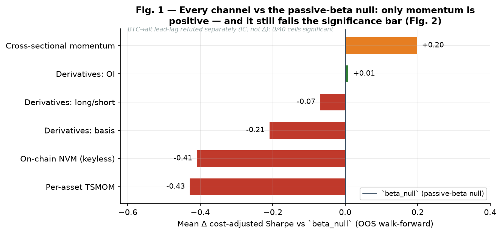
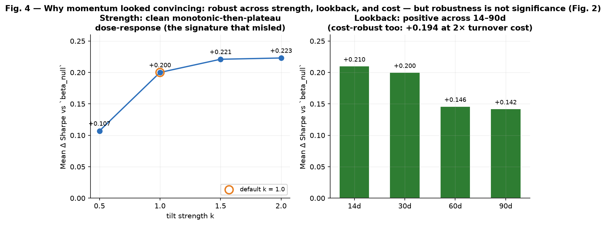
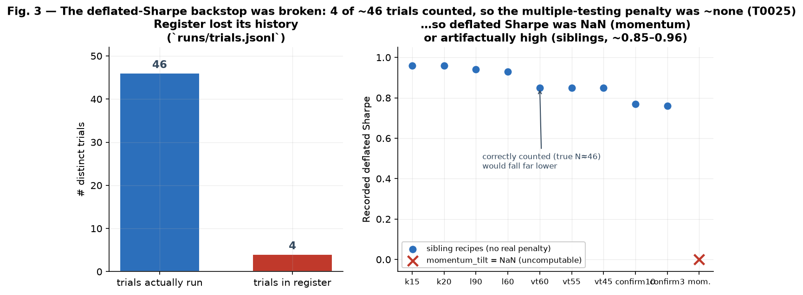
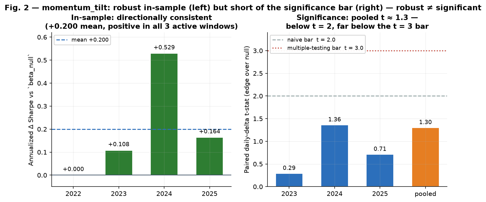

# Phase 2 Stage-2 Results — zcrypto

*Closes the bets opened by [`03.phase2-orientation.md`](03.phase2-orientation.md). Reports the
outcome of the Stage-2 alpha search (iters 35–55, run mostly by the unattended research loop)
against the orientation's question: **is there any capturable edge beyond a simple regime-gated
passive-beta rule on majors?** Written to be honest, not confirmatory — a negative is a result.
Every quantitative claim is backed by a table in the [Data appendix](#data-appendix); figures are
reproducible from those tables via
[`04.phase2-figures/make_figures.py`](04.phase2-figures/make_figures.py). Companion documents: the
Phase-1 summary [`02.phase1-summary.md`](02.phase1-summary.md), the orientation
[`03.phase2-orientation.md`](03.phase2-orientation.md), and the authoritative per-iteration log
[`../iterations-history.md`](../iterations-history.md).*

> **Correction (2026-06-25).** An earlier version of this report named `momentum_tilt` as "the one
> edge" that beat the passive-beta null. That promotion was an **artifact of a broken validation
> check**, not a real result. The deflated-Sharpe multiple-testing backstop was silently
> non-functional (its trial register had lost its history → `momentum_tilt`'s deflated Sharpe came
> back `NaN`), so the candidate was never actually tested against the project's pre-registered
> `t > 3` hurdle. Assessed properly it **fails that bar** (pooled paired daily-delta `t ≈ 1.3`). The
> report below has been corrected: **Stage-2 found zero confirmed edges.** The validation bug is
> tracked in [`T0025`](../open-topics/T0025-trial-register-durability.md); the candidate is
> downgraded in [`T0024`](../open-topics/T0024-momentum-tilt-holdout-confirmation.md).

<!-- mdformat-toc start --slug=github --maxlevel=3 --minlevel=2 -->

- [0. The one-paragraph bottom line](#0-the-one-paragraph-bottom-line)
- [Key facts at a glance](#key-facts-at-a-glance)
- [Reading this report — measurement lenses](#reading-this-report-%E2%80%94-measurement-lenses)
- [1. The yardstick](#1-the-yardstick)
- [2. The bets and their outcomes](#2-the-bets-and-their-outcomes)
- [3. The `momentum_tilt` result — a measurement artifact, not an edge](#3-the-momentum_tilt-result-%E2%80%94-a-measurement-artifact-not-an-edge)
- [4. The deployable today](#4-the-deployable-today)
- [5. Parked decisions (human-ratified — the loop did not take these)](#5-parked-decisions-human-ratified-%E2%80%94-the-loop-did-not-take-these)
- [6. Honest meta-conclusion + the next frontier](#6-honest-meta-conclusion--the-next-frontier)
- [Data appendix](#data-appendix)
  - [B.1 — All channels: mean Δ-vs-`beta_null` (OOS walk-forward)](#b1-%E2%80%94-all-channels-mean-%CE%B4-vs-beta_null-oos-walk-forward)
  - [B.2 — `momentum_tilt` per-window Δ + daily-delta significance (iter-47, #99)](#b2-%E2%80%94-momentum_tilt-per-window-%CE%B4--daily-delta-significance-iter-47-99)
  - [B.3 — `momentum_tilt` robustness axes (iters 48–50, #100–#102)](#b3-%E2%80%94-momentum_tilt-robustness-axes-iters-48%E2%80%9350-100%E2%80%93102)
  - [B.4 — The broken trial register / deflated Sharpe (`T0025`)](#b4-%E2%80%94-the-broken-trial-register--deflated-sharpe-t0025)
  - [B.5 — The deployable (`beta_null` / `regime_voltarget`)](#b5-%E2%80%94-the-deployable-beta_null--regime_voltarget)
- [Provenance & reproducibility](#provenance--reproducibility)

<!-- mdformat-toc end -->

______________________________________________________________________

## 0. The one-paragraph bottom line

Stage-2 tested every reversible alpha lever the orientation named, plus several it did not, against
the **passive-beta null `beta_null`** (200d-SMA-gated inverse-vol top-10 majors, ~0.31–0.38 OOS
Sharpe). One candidate *appeared* to survive — a cross-sectional momentum tilt (`momentum_tilt`,
+0.200 mean delta-vs-null, positive in all three active OOS windows) — and an earlier version of this
report promoted it to "the one edge." **That promotion was wrong: it rested on a broken
multiple-testing check.** The deflated-Sharpe backstop (the project's false-discovery defense, the
Harvey-Liu-Zhu `t > 3` hurdle) was silently inoperative — the trial register `runs/trials.jsonl` had
lost its history, so `momentum_tilt`'s deflated Sharpe came back `NaN` and the candidate was never
vetted against the bar. Assessed honestly on the saved paired daily-delta bootstraps, momentum's edge
over the null pools to **`t ≈ 1.3`** — below even the naive `t > 2`, far below the `t > 3`
multiple-testing bar. So the corrected verdict is: **Stage-2 found zero confirmed edges.** Every lever
— per-asset trend-following, the entire derivatives-positioning channel (basis / OI / long-short / a
multi-factor ML model), keyless on-chain valuation, the BTC→alt intraday lead-lag, every
regime-overlay refinement, **and** the cross-sectional momentum tilt — is refuted, tapped, noise, or
fails the bar. The reversible alpha-search space is **exhausted with no survivor.** The deployable
answer is the defensive baseline `beta_null` / `regime_voltarget` (~0.31 OOS): **this is
beta-timing, not alpha.** The validation bug that produced the false positive is tracked in
[`T0025`](../open-topics/T0025-trial-register-durability.md).

## Key facts at a glance

| Item                 | Value                                                                                                                                     |
| -------------------- | ----------------------------------------------------------------------------------------------------------------------------------------- |
| **Operating scope**  | Daily bars, spot-only, Binance-EEA, ~$10,000, long/cash; top-10-liquidity PIT-monthly majors                                              |
| **Yardstick**        | `beta_null` — 200d-SMA-gated, inverse-vol, `vol_target=0.50`, `vip2_bnb` costs (~0.31–0.38 OOS Sharpe)                                    |
| **Measure**          | Cost-adjusted **paired Δ-vs-null** on the `zcrypto stress` OOS walk-forward, with stationary-bootstrap CIs                                |
| **Channels tested**  | Per-asset TSMOM, derivatives (basis / OI / long-short / ML), keyless on-chain, BTC→alt lead-lag, regime-overlay, cross-sectional momentum |
| **Confirmed edges**  | **0** — every channel refuted, tapped, or fails the significance bar                                                                      |
| **Momentum verdict** | `momentum_tilt` +0.200 Δ looked like an edge but was a **validation artifact**: pooled daily-delta `t≈1.3 ≪ t>3`                          |
| **Root cause**       | Deflated-Sharpe backstop silently broken — trial register lost its history (4 of ~46 trials), deflated Sharpe `NaN` (`T0025`)             |
| **Deployable today** | `beta_null` / `regime_voltarget` (~0.31 OOS) — beta-timing, not alpha                                                                     |
| **Next frontier**    | Fix the measurement (`T0025`/`T0026`); new data (credentialed on-chain `T0021`, order-book `T0010`); out-of-time validation               |

## Reading this report — measurement lenses

Three distinctions below **must not be conflated**:

- **Annualized per-window ΔSharpe** vs **per-period daily-delta t-stat.** The headline channel deltas
  (e.g. momentum +0.200) are *annualized* differences of mean Sharpe across the OOS windows — good for
  ranking, but **not** a significance test. The daily-delta **t-stat** (point/SE of the paired
  bootstrap on the daily return difference) is the significance read; momentum is strong on the first
  lens and weak on the second (`t≈1.3`). Robustness (a result holding across knobs) is a *third* thing
  again — neither lens — and does not imply significance.
- **Cost-adjusted, paired, vs the null.** Every Δ is net of realistic fees + slippage, paired against
  `beta_null` on the same window (never gross ending value).
- **In-sample vs out-of-time.** The 2025 `test` segment overlaps the `oos_2025` stress window the search
  read repeatedly, so it is **in-sample**, not a pristine holdout (`T0026`). "Confirmed" requires
  genuinely-new out-of-time data.
- **Deflated Sharpe / trial register.** The multiple-testing hurdle (Harvey-Liu-Zhu `t > 3`) deflates a
  candidate's Sharpe against the count of trials run. Here that machinery returned `NaN` / no-penalty
  because the register lost its history (`T0025`) — so it could not enforce the hurdle.

## 1. The yardstick

`beta_null` is the Stage-0 passive-beta null: top-10-liquidity (PIT, monthly) majors, a binary BTC
200d-SMA risk-on/off gate, inverse-vol weighting, `vol_target=0.50`, realistic `vip2_bnb` costs. Its
defensive virtue is **clean full-cash-in-bear** (0.00 in 2022). Every Stage-2 idea was A/B'd against it
on the OOS walk-forward harness (`zcrypto stress`), read on the **cost-adjusted paired delta-vs-null
with a stationary-bootstrap CI**, never gross ending value. `regime_voltarget` (the same gate with the
vol-target lever, ~0.31 OOS) is the established deployable; `beta_null` is the comparison null.

## 2. The bets and their outcomes

| Channel (orientation ref)                   | What was tested                                                                          | Verdict                                                                                                                                                    | Iters        |
| ------------------------------------------- | ---------------------------------------------------------------------------------------- | ---------------------------------------------------------------------------------------------------------------------------------------------------------- | ------------ |
| **Per-asset TSMOM** (`T0019`/`T0022`)       | per-asset trend gate @100d / @200d / composed-on-market-gate                             | **REFUTED** — loses to the null at every form (whipsaw/lag); the market gate's clean full-cash-in-bear can't be replicated per-asset                       | 35–37        |
| **Derivatives — basis** (`T0023`)           | `$basis` as a timing gate AND a cross-sectional crowding tilt                            | **REFUTED** (−0.21 / −0.18) — basis behaves like a demand/momentum proxy, not contrarian                                                                   | 39–40        |
| **Derivatives — OI** (`T0023`)              | OI-price divergence tilt (symmetric / directional / strong-trend-gated)                  | **NEUTRAL** (~+0.01) — a real but bull-regime-only effect; not robust                                                                                      | 41–42, 44    |
| **Derivatives — long/short** (`T0023`)      | smart-money `$ls_top/$ls_global` follow tilt                                             | **NEGATIVE** (−0.07) — smart-money-long coins were the laggards                                                                                            | 43           |
| **Derivatives — multi-factor ML** (`T0023`) | LGBModel over all derivatives fields (`derivatives_steady`)                              | **MARGINAL/SUB-PASSIVE** — beats `steady` +0.05 but stays far below `beta_null`                                                                            | 45           |
| **On-chain regime** (`T0021`)               | keyless NVM (market-cap / active-addresses²) de-risk overlay                             | **REFUTED** (−0.41) — de-risks in bulls (fades strength). **Discovery:** keyless Coin Metrics lacks MVRV-Z/NUPL/NVT (credentialed → parked)                | 46           |
| **BTC→alt lead-lag** (`T0020`)              | offline feasibility probe, majors AND less-liquid mid-caps, 1–6h                         | **REFUTED both universes** — 0/40 cells significant, weak negative IC; the multi-week harness build correctly avoided                                      | 51–52        |
| **Regime-overlay tuning** (`T0017`)         | graded / vol-target / funding-stack / cross-asset-stack / anti-whipsaw / vol_target-grid | **ALL CLOSED** — `regime_voltarget` is the ~0.31 OOS defensive ceiling                                                                                     | 23–26, 53–55 |
| **Cross-sectional MOMENTUM**                | overweight the basket's recent relative winners                                          | **ARTIFACT / UNCONFIRMED** — apparent +0.200 was promoted past a broken deflated-Sharpe check; fails the bar (pooled daily-delta `t≈1.3` ≪ `t>3`) — see §3 | 47–50        |

A recurring structural finding ties the negatives together: **in the 2022–2025 sample the market
rewards momentum/strength** — every *fade-strength* signal (basis-crowding, smart-money-follow,
NVM-de-risk) lost. Momentum was the one direction that did not immediately *lose* — but, properly
assessed, it does not clear the significance bar either (§3).

*Data: appendix B.1. Per-asset TSMOM, on-chain NVM, and basis are decisively negative; OI is ~flat;
only momentum is positive (and §3 shows it fails the bar). BTC→alt lead-lag is refuted on a separate
IC probe (0/40 cells significant), not a Δ-vs-null, so it is not on this axis.*

## 3. The `momentum_tilt` result — a measurement artifact, not an edge

A cross-sectional momentum tilt on `beta_null`: tilt the inverse-vol weights toward coins with the
strongest recent relative return (`w_i *= exp(+k·z_i)` over a trailing-return z-score, k=1.0, 30d),
renormalized, no look-ahead. Its in-sample descriptive numbers looked strong: **+0.200 mean
delta-vs-`beta_null`, positive in all three active OOS windows**, and directionally consistent across
four perturbation axes — direction (iter-47), lookback (+0.14 to +0.21 across 14/30/60/90d, iter-48),
cost (+0.194 at 2× the maker-fill haircut, iter-49), and strength (a monotonic-then-plateau k
dose-response, iter-50). On that basis it was promoted to "the project's first edge."

*Data: appendix B.3. The clean k dose-response and the lookback/cost stability are exactly what made
the candidate look convincing — but robustness across knobs is not statistical significance (next).*

**Why that was wrong.** In-sample *robustness* is not statistical *significance*, and the check that
was supposed to enforce the difference — the deflated Sharpe against the pre-registered trial budget —
**was silently broken** (see [`T0025`](../open-topics/T0025-trial-register-durability.md)). The trial
register `runs/trials.jsonl` had lost its history (4 of ~46 trials survived), so `momentum_tilt`'s
recorded `deflated_sharpe` is **`NaN`** — the candidate was *never actually tested* against the `t > 3`
multiple-testing hurdle the orientation pre-committed to (§5.4). The non-`NaN` deflated Sharpes on
sibling recipes (`k15` 0.96, `l60` 0.93, …) are equally hollow: they deflated against the same tiny,
near-zero-variance register, i.e. with **no real penalty.**

*Data: appendix B.4. With only 4 near-identical trials visible, `expected_max_sharpe` (the bar the
candidate must beat) collapses to ≈0, so the deflation applies no real penalty; the correct N≈46 would
raise that bar sharply.*

**Assessed properly, momentum fails the bar.** The saved per-window paired daily-delta bootstraps are
the trustworthy significance read. Converting each to a t-stat (point/SE): oos_2023 **t≈0.29**, oos_2024
**t≈1.36**, oos_2025 **t≈0.71**; every window's daily CI straddles 0. Inverse-variance-pooled across
the three active windows (years treated as independent): **t ≈ 1.3** — below the naive `t > 2`, and
~2.3× short of the `t > 3` multiple-testing bar. And a *correctly* counted deflated Sharpe (true
N≈46 trials) would be **lower**, not higher, than the broken `NaN`/no-penalty values — the
expected-max-under-null bar rises with N. So there is no reading on which momentum clears the bar.

*Data: appendix B.2. Left: the annualized per-window Δ that looked like an edge. Right: the per-period
daily-delta t-stat — the actual significance — pooling to `t≈1.3`, below the naive `t=2` and far below
the multiple-testing `t=3`.*

**Conclusion.** `momentum_tilt` is a **weak, unconfirmed in-sample signal**, not a confirmed edge.
Continuing to present it as "the first edge" would mislead future research planning (e.g. into spending
a holdout look, or building on it as a proven base). It is downgraded accordingly
([`T0024`](../open-topics/T0024-momentum-tilt-holdout-confirmation.md)). The honest residual: *if*
momentum is real, only genuinely-new **out-of-time** data (which the search never saw) could show it —
the existing 2025 "holdout" is already baked into the +0.200 (it overlaps the `oos_2025` stress
window).

## 4. The deployable today

With no candidate clearing the bar, the deployable is the **passive-beta defensive baseline
`beta_null` / `regime_voltarget` (~0.31 OOS Sharpe)** — robust, cheap, and explicitly **beta-timing,
not alpha.** Every Stage-2 overlay either failed to beat the null or (momentum) failed the significance
bar once the broken check was repaired. This is exactly the orientation's disciplined prior: beyond a
regime-gated passive-beta rule, capturable edge on this data is scarce-to-absent.

## 5. Parked decisions (human-ratified — the loop did not take these)

1. **The `momentum_tilt` reserved-holdout look is moot — do not spend it on the 2025 segment.** Two
   independent reasons: (a) momentum **fails its in-sample significance bar** (pooled daily-delta
   `t≈1.3`), so there is no candidate worth a one-shot look; and (b) the `test` segment (2025-01-01 →
   2026-06-15) is **not pristine** — it is the same period as the `oos_2025` stress window already
   inside the +0.200, so a "look" there is confirmatory of seen data, not an independent test. The only
   genuine confirmation is **out-of-time data the search never touched** (forward-walk / paper
   validation, ties to `T0006`).
1. **Credentialed on-chain data** (`T0021`) — the keyless NVM proxy failed, but the *better* metric
   (realized-cap-based MVRV-Z/NUPL) is credentialed-only (Coin Metrics PRO / CryptoQuant / BigQuery). The
   keyless failure does **not** condemn MVRV-Z; the head-to-head vs the SMA gate is parked on that data.
1. **Shelve derivatives-positioning** (`T0023`) — well-evidenced (6 single-factor signals + ML, none beats
   the null), but a strategic-channel-kill is left for an attended decision.
1. **Fix the validation-integrity gap before trusting any future candidate** (`T0025`) — the deflated
   Sharpe / trial-register backstop that produced this false positive must be made durable and
   recomputable; until it is, no candidate's multiple-testing standing can be believed.

## 6. Honest meta-conclusion + the next frontier

After Phase-1 (OHLCV-ML, exhausted — `T0018`) and Phase-2 Stage-2 (~20 reversible iterations), the
honest tally is **zero confirmed edges**: the one apparent candidate (momentum) was a measurement
artifact of a broken multiple-testing check, and the OHLCV / regime / derivatives / keyless-on-chain /
intraday-lead-lag space is otherwise tapped. The reusable apparatus built along the way is substantial
(the derivatives + on-chain fetchers, the cross-sectional tilt machinery, the offline lead-lag probe,
the regime debounce) — but the episode also exposed that **the validation harness's false-discovery
backstop was not actually working** (`T0025`). **The next frontier is genuinely-new information or a
decisive out-of-time test:**

- **First, fix the measurement:** repair the trial register / deflated-Sharpe integrity (`T0025`) so any
  future candidate is judged against a real bar — without it, the search cannot tell an edge from noise.
- **For new edge:** the only untried levers need new data — **credentialed on-chain valuation**
  (`T0021`, parked) or **order-book / microstructure** (`T0010` remainder) — both heavy and out of the
  unattended loop's reversible scope. The daily-OHLCV / keyless space is closed.
- **For confirmation, not discovery:** genuinely-new **out-of-time** data (forward-walk / paper
  validation) is the only way to retest any in-sample signal, momentum included.

The disciplined reading: the project has a robust ~0.31 defensive beta-timing deployable and **no
confirmed alpha**. The Stage-2 search did not find an edge — and the one time it looked like it had, the
cause was a broken validation check, not a signal.

## Data appendix

All quantitative claims consolidated, with provenance. Sharpe values are cost-adjusted; every Δ is the
paired difference vs `beta_null` on the `zcrypto stress` OOS walk-forward unless noted. See
[Reading this report — measurement lenses](#reading-this-report--measurement-lenses) for the lenses.

### B.1 — All channels: mean Δ-vs-`beta_null` (OOS walk-forward)

| Channel (representative recipe)                 | Mean Δ vs `beta_null`        | Verdict                       | Iter / PR           |
| ----------------------------------------------- | ---------------------------- | ----------------------------- | ------------------- |
| Per-asset TSMOM (`tsmom_voltarget`)             | −0.43                        | refuted                       | 35 / #83            |
| Per-asset TSMOM (`tsmom_compose`)               | −0.11                        | refuted                       | 37 / #85            |
| Derivatives — basis (`basis_froth` / `_tilt`)   | −0.21 / −0.18                | refuted                       | 39–40 / #91         |
| Derivatives — OI (`oi_div_tilt` / dir / strong) | +0.008 / +0.010 / −0.014     | neutral (bull-only)           | 41–44 / #93,#94,#96 |
| Derivatives — long/short (`smart_money_tilt`)   | −0.07                        | negative                      | 43 / #95            |
| Derivatives — ML (`derivatives_steady`)         | +0.05 *vs `steady`* (≪ null) | sub-passive                   | 45 / #97            |
| On-chain NVM (`onchain_regime`)                 | −0.41                        | refuted                       | 46 / #98            |
| Cross-sectional momentum (`momentum_tilt`)      | **+0.200**                   | **artifact** (fails bar, B.2) | 47 / #99            |

*BTC→alt lead-lag (`T0020`) is an offline IC probe, not a Δ-vs-null: 0/40 cells positive-and-significant
across both the liquid majors and less-liquid mid-caps (iters 51–52, #104/#105).*

### B.2 — `momentum_tilt` per-window Δ + daily-delta significance (iter-47, #99)

| Window        | Annualized ΔSharpe | Daily-delta CI [lo, hi] | Daily-delta t |
| ------------- | ------------------ | ----------------------- | ------------- |
| 2022          | +0.000             | [0, 0] (full cash)      | —             |
| 2023          | +0.108             | [−0.046, +0.062]        | 0.29          |
| 2024          | +0.529             | [−0.011, +0.069]        | 1.36          |
| 2025          | +0.164             | [−0.014, +0.031]        | 0.71          |
| mean / pooled | **+0.200**         | —                       | **1.30**      |

*Hurdles: naive `t > 2.0`; Harvey-Liu-Zhu multiple-testing `t > 3.0`. The pooled t is inverse-variance
across the three active windows (years treated as independent). Every per-window daily CI straddles 0.*

### B.3 — `momentum_tilt` robustness axes (iters 48–50, #100–#102)

| Axis                 | Setting → mean ΔSharpe                            |
| -------------------- | ------------------------------------------------- |
| Lookback (iter-48)   | 14d +0.210 · 30d +0.200 · 60d +0.146 · 90d +0.142 |
| Cost (iter-49)       | 1× +0.200 · 2× turnover haircut +0.194            |
| Strength k (iter-50) | 0.5 +0.107 · 1.0 +0.200 · 1.5 +0.221 · 2.0 +0.223 |

*All positive — robust across knobs. Robustness is not significance (B.2); these axes are why the
candidate looked convincing.*

### B.4 — The broken trial register / deflated Sharpe (`T0025`)

| Item                                               | Value                                                                                                          |
| -------------------------------------------------- | -------------------------------------------------------------------------------------------------------------- |
| Distinct trials actually run (stress bundles)      | ~46                                                                                                            |
| Distinct trials in `runs/trials.jsonl` (surviving) | 4 (`beta_null_vt40/45/55/60`, Sharpe ≈ 0.025, near-zero variance)                                              |
| `momentum_tilt` recorded deflated Sharpe           | **NaN** (uncomputable — \<2 trials visible)                                                                    |
| Sibling deflated Sharpe (no real penalty)          | k15 0.96 · k20 0.96 · l90 0.94 · l60 0.93 · vt60 0.85 · vt55 0.85 · vt45 0.85 · confirm10 0.77 · confirm3 0.76 |

*`deflated_sharpe` deflates against `expected_max_sharpe(sr_trials)`; with 4 near-identical trials that
bar ≈ 0, so ≈ no penalty. The register lives in gitignored `runs/`, which is how it lost its history.*

### B.5 — The deployable (`beta_null` / `regime_voltarget`)

| Recipe             | Across-window mean OOS Sharpe | Role                                             |
| ------------------ | ----------------------------- | ------------------------------------------------ |
| `beta_null`        | ~0.31–0.38                    | the pre-registered passive-beta null (yardstick) |
| `regime_voltarget` | ~0.31                         | the established deployable (gate + vol-target)   |

*Defensive virtue: clean full-cash-in-bear (0.00 in 2022). This is beta-timing, not alpha.*

## Provenance & reproducibility

| Finding                                          | Iteration | PR                                                                                                         |
| ------------------------------------------------ | --------- | ---------------------------------------------------------------------------------------------------------- |
| Per-asset TSMOM refuted                          | 35–37     | [#83](https://github.com/zhaow-de/zcrypto/pull/83)–[#85](https://github.com/zhaow-de/zcrypto/pull/85)      |
| Derivatives data + basis refuted                 | 38–40     | [#86](https://github.com/zhaow-de/zcrypto/pull/86), [#91](https://github.com/zhaow-de/zcrypto/pull/91)     |
| OI divergence (neutral) / smart-money (negative) | 41–44     | [#93](https://github.com/zhaow-de/zcrypto/pull/93)–[#96](https://github.com/zhaow-de/zcrypto/pull/96)      |
| Derivatives ML (sub-passive)                     | 45        | [#97](https://github.com/zhaow-de/zcrypto/pull/97)                                                         |
| On-chain NVM refuted                             | 46        | [#98](https://github.com/zhaow-de/zcrypto/pull/98)                                                         |
| `momentum_tilt` +0.200 + robustness (4 axes)     | 47–50     | [#99](https://github.com/zhaow-de/zcrypto/pull/99)–[#102](https://github.com/zhaow-de/zcrypto/pull/102)    |
| BTC→alt lead-lag refuted (both universes)        | 51–52     | [#104](https://github.com/zhaow-de/zcrypto/pull/104), [#105](https://github.com/zhaow-de/zcrypto/pull/105) |
| Regime anti-whipsaw + vol_target sweeps (closed) | 53–55     | [#106](https://github.com/zhaow-de/zcrypto/pull/106)–[#108](https://github.com/zhaow-de/zcrypto/pull/108)  |
| Momentum = validation artifact; report corrected | —         | [#111](https://github.com/zhaow-de/zcrypto/pull/111)                                                       |

Figures are generated by [`04.phase2-figures/make_figures.py`](04.phase2-figures/make_figures.py) from
the numbers in this appendix (`uv run python docs/research/04.phase2-figures/make_figures.py`).
